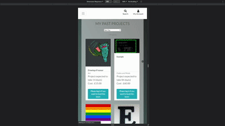

Page Link : https://ci-eoncustoms.herokuapp.com/

# Purpose of the Project :

The aim of this project is to build a full-stack website that allows users to suggest and fund projects from me. It is intended to have a list of items that are suggested by users but must first must be approved by an admin before they are public and possible to be funded. Once a project is funded, the user who funded the project will recieve updates on the project. All projects can be commented on by users.

# Database Plan

ER diagram:

# Visual Design :

The page is a top white bar that lets the user navigate to a page with all suggested projects and a button to submit a new project. A search bar will always be accessible and a user page will be available top right.

Viewing list of projects will draw an array of cards that can then be clicked and viewed individually with more detail. Underneath the extra detail is comments and if the user can fund the project, a button to do so and go to a checkout is available.

Suggesting a project will be a form that lets you upload an image and select a timeframe/category, and it will give a preliminary pricing for the item before it is decided for sure on review.

# User Stories :

| As A..    | I want to be able to...                                                 | So that...                                                             |
| --------- | ----------------------------------------------------------------------- | ---------------------------------------------------------------------- |
| Site user |                                                                         |                                                                        |
| \`        | Register                                                                | i can comment on, fund and suggest new projects                        |
| \`        | Login                                                                   | i can access my account                                                |
| \`        | Reset password                                                          | i can log in if i forget details                                       |
| \`        | enable/disable emails                                                   | my preferences are followed                                            |
| \`        | leave comments                                                          | my opinion is seen on the projects                                     |
| \`        | View Details on a given project                                         | i can see whats being made                                             |
| \`        | View Comments                                                           | i can view others views                                                |
| Browser   |                                                                         |                                                                        |
| \`        | View all projects                                                       | i can see what kinds of things have been made/are currently being made |
| \`        | Sort projects                                                           | i can see projects in an order i like                                  |
| \`        | Search projects                                                         | i can find projects that fit in a description i like                   |
| Suggester |                                                                         |                                                                        |
| \`        | Suggest a project                                                       | my idea is seen and could be made                                      |
| \`        | view all projects i've suggested                                        | i can go back and see if theres any changes to them                    |
| \`        | view updates on projects i've suggested                                 | i can see what changes have been made                                  |
| \`        | recieve email updates on projects i've suggested                        | i can be notified of updates                                           |
| Funder    |                                                                         |                                                                        |
| \`        | Fund a project                                                          | it can be made and i can know its being made                           |
| \`        | Safely pay for funding with card and know that my purchase went through | my payment can be made and i can know it worked out                    |
| \`        | View all projects i've funded                                           | i can go back and see if theres any changes to them                    |
| \`        | view updates on projects i've funded                                    | i can see what changes have been made                                  |
| \`        | recieve email updates on projects i've funded                           | i can be notified of updates                                           |
| Admin     |                                                                         |                                                                        |
| \`        | Edit a project thats already up                                         | its details can be adjusted to better fit what can actually be done    |
| \`        | approve not yet approved projects so they are visible to all users      | it is visible to users to then fund                                    |
| \`        | Delete bad projects                                                     | if its not fitting to the website it can be declined                   |
| \`        | Currate comments/delete comments                                        | spam can be removed                                                    |
| \`        | Send Project updates out                                                | the people who funded/suggested it can see what progress is being made |

# Features :

## User account : 

implemented by django-allauth, extended in the "profiles" app to add a way for the user to enable/disable email updates. 

## Projects :

Mostly implemented in the projects django app

- Suggesting :

The user can suggest an idea that will be held for admin review and then can be funded

- Viewing :

A full list of all projects with sorting is available

- Commenting :

On all approved projects, there is a comment section at the bottom of the page and when logged in you can post your own comments

## Moderation :

- Project Edit :

The ability to add/edit a given project to adjust expected time intervals, adjust description etc as well as approve a not yet approved project idea is available

Admins can approve projects and every not-yet approved project is marked as such. They also gain the ability to sort by approved first/last in the all-projects page.

- Project Delete :

a project can be deleted by admins, if this is done, purchase of it is not deleted, but the actual details are deleted.

- Comment Delete :

Admins can specifically delete any comments demed innapropriate. 

## Payments : 

Stripe used for user payments to allow an easy way to handle payments and track them longterm

- Webhook stuff :

Stripe webhooks are used so that if a user does something weird with the site/an error occurs causing the initial payment to not be stored, then stripe can send the payment through later to store to make sure it is saved to the database. 

## Account :

Most account stuff is handled through django's allauth,

- Change settings : 

the user has an additional option to enable/disable recieving email updates for projects they have suggested/funded.

- View Bought/Checked :

On the users page the list of all projects they have funded and a list of all projects they have suggested is available, each with a button to view updates for them.

# Testing

## [Client Story Testing found here](testing/clientStory.md)

## Mobile Layout

# Deployment

This project was deployed using heroku to host the site and the main database, and then using amazon webservices to host the images and static files.

## Heroku

To deploy this page to heroku, the initial heroku app was made and it was linked to the project through syncing with the git. 

In heroku settings, the django-postgres addon is then enabled to handle the database setup. The database url/key were then taken from django environment urls, and loaded locally temporarily so that django migrations could be applied to the new database (and to re-add the admin superuser). 

The django setup was updated to have the dj_database_url, psycopg2-binary and gunicorn modules and a procfile made to use gunicorn.

Environment variables made for 

- EMAIL_HOST_USER and EMAIL_HOST_PASS
- SECRET_KEY, STRIPE_PUBLIC_KEY, STRIPE_SECRET_KEY and STRIPE_WEBHOOK_SECRET

## Amazon webservices

After signing up for AWS, a User Group through the Identity and Access Management system was created and then a new Bucket was made through S3. 

The keys created in this creation were then added to the django setup in the environment variables AWS_ACCESS_KEY_ID and AWS_SECRET_ACCESS_KEY. 

The django file is set up such that if environment variable "USE_AWS" is set that it will read those environment variables and save data into it instead of the page.

# Site

Page can be found at : https://ci-eoncustoms.herokuapp.com/
